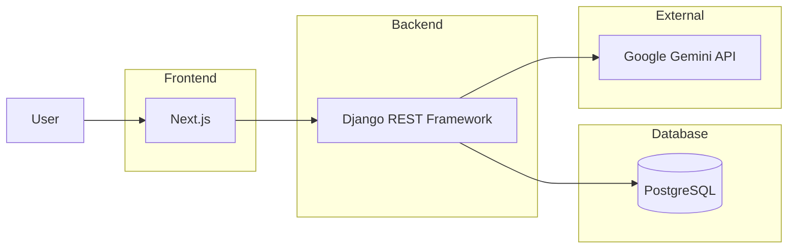
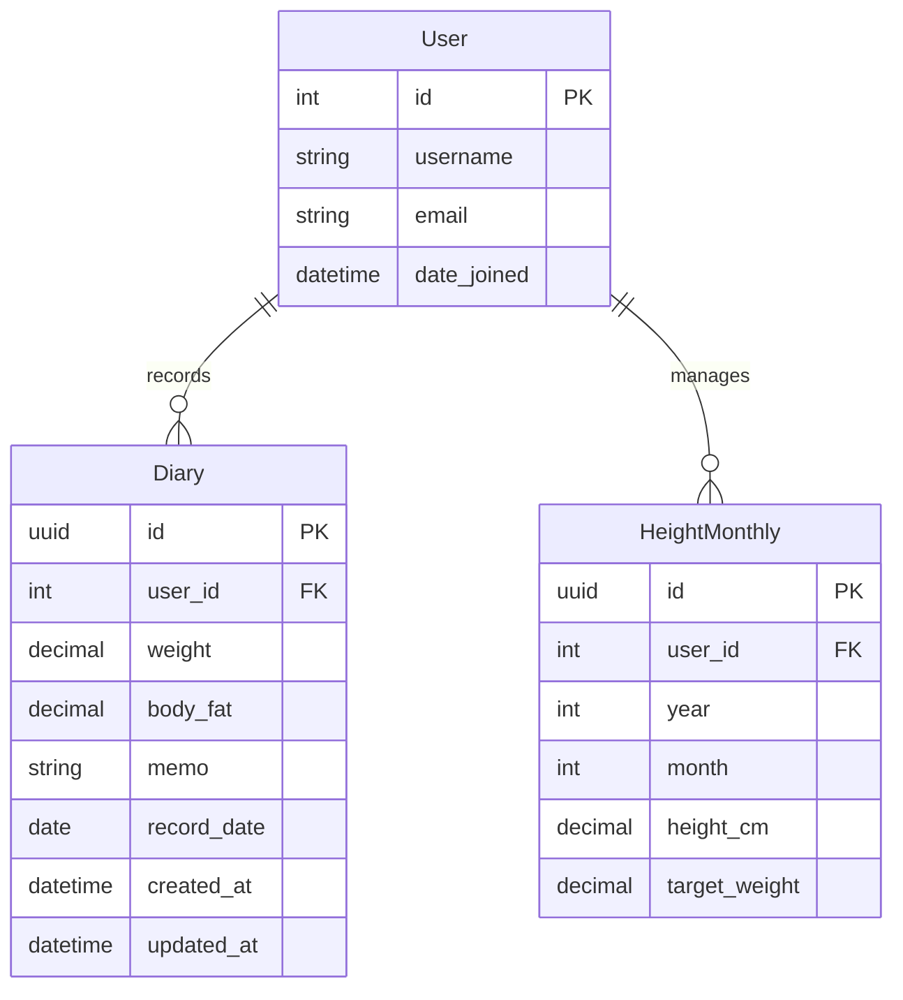
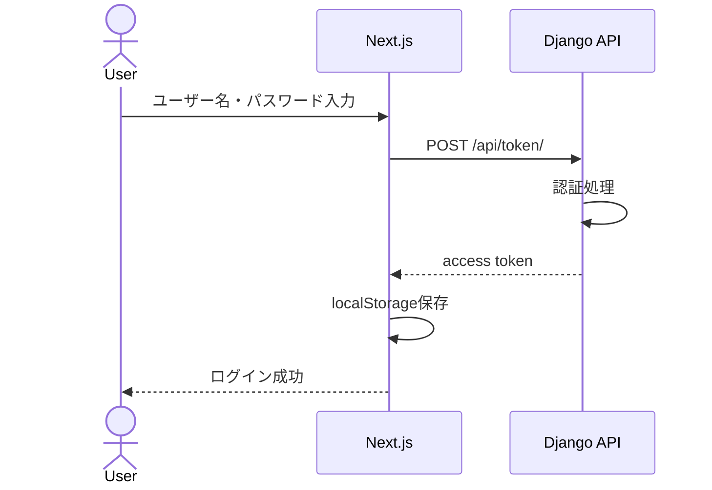
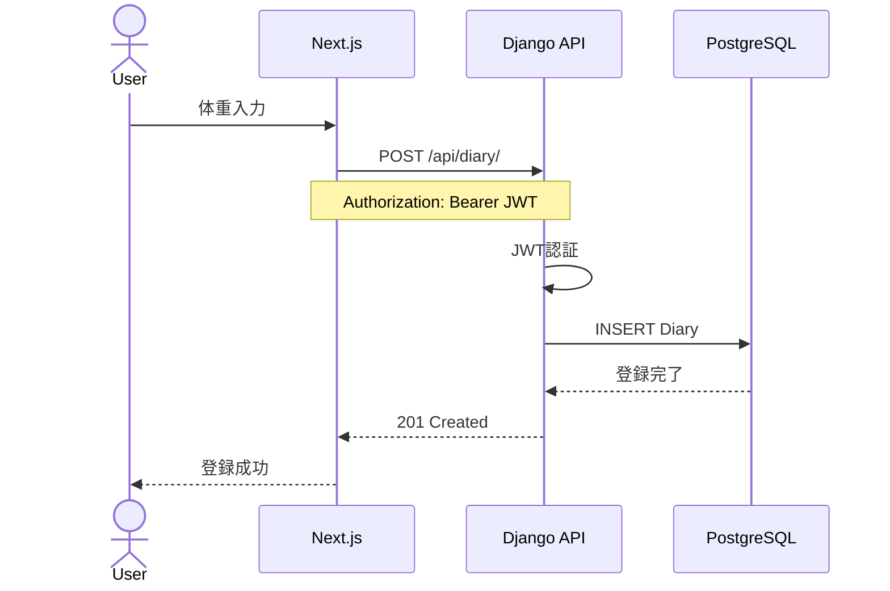
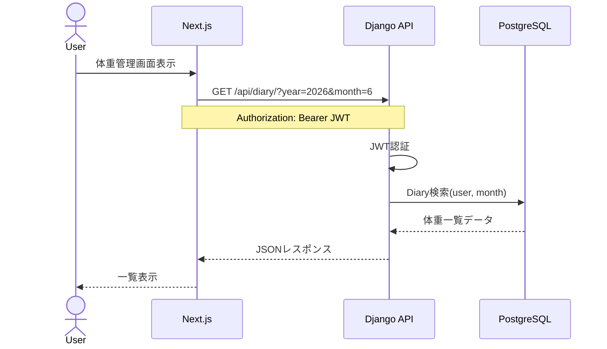
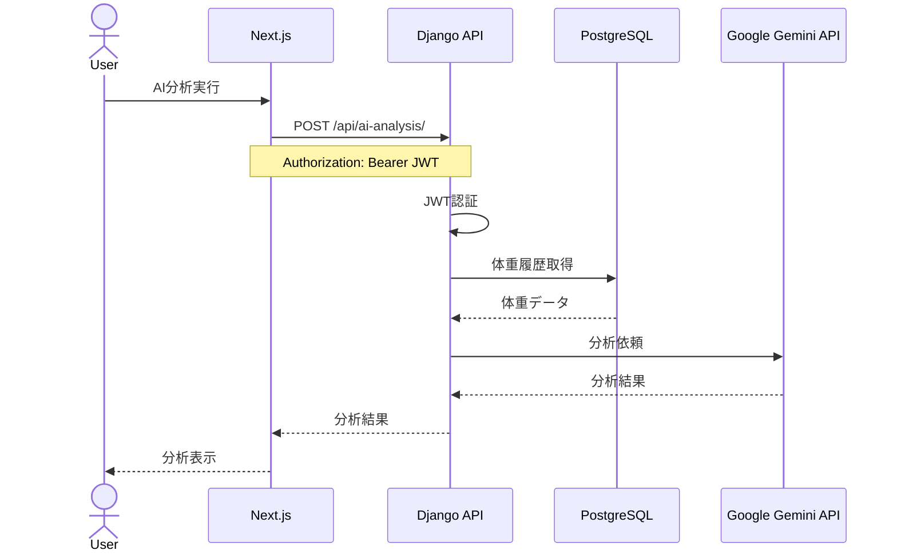
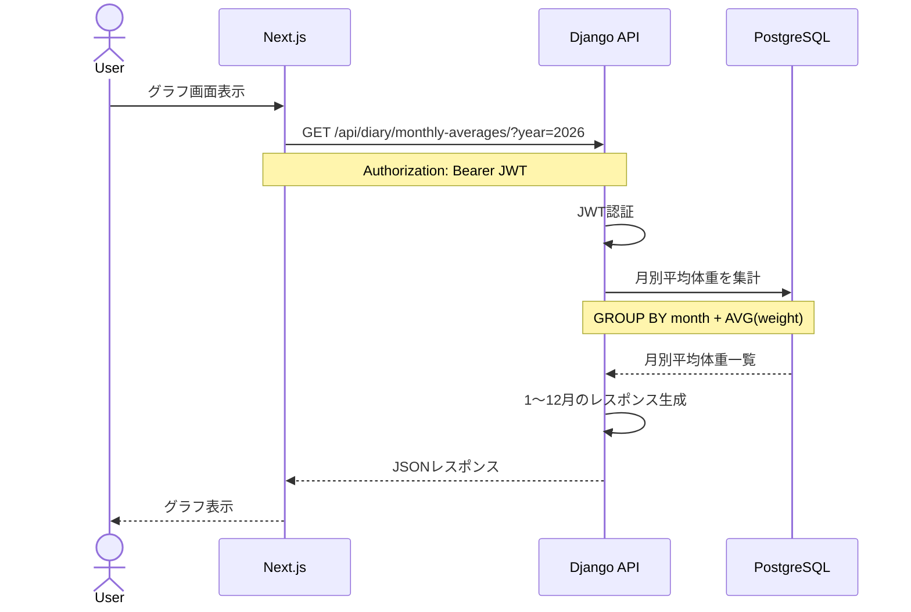

# 体重管理アプリ

## 概要
日々の体重データを登録・管理できるほか、月別平均体重の可視化や目標体重の管理、AIによる体重推移の分析機能を提供します。

- JWT認証によるログイン機能
- 体重・体脂肪率の記録
- 体重記録の一覧表示
- 月別平均体重の集計
- グラフによる体重推移の可視化
- 身長・目標体重の管理
- Gemini APIを利用した体重推移のAI分析
- Swagger(OpenAPI)によるAPIドキュメント

## 環境構築
1. git clone <repogitory>
2. cp .env.example .env.dev
   * GEMINI_API_KEYを設定
3. docker compose up --build 
4. docker compose exec backend python manage.py migrate
5. docker compose exec backend python manage.py create_users
6. docker compose exec backend python manage.py create_height_dummy
7. docker compose exec backend python manage.py create_weight_dummy


## 入力バリデーション

### ユーザーAPI

| 項目 | 制約 |
|--------|--------|
| ユーザー名 | 重複不可（Django標準Userモデルの一意制約） |

### 体重API 
| 項目 | 制約 | 
|--------|--------| 
| 体重 | 20～300 |
| ^ |同日登録不可 | 
| 体脂肪 | 0〜60 | 


### 身長・目標体重API 
| 項目 | 制約 | 
|--------|--------| 
| 身長 | 50～300 | 
| ^ | 同年月登録不可 | 
| 目標体重 | 20～300 |

## CI
GitHub Actionsを使用し、以下を自動実行しています。

### Backend
- Django Unit Test
- Coverage計測

### Frontend
- ESLint
- TypeScript型チェック

## Load Test (k6)
ローカル環境でk6を用いてAPI負荷テストを実施しました。
(tests/load/diary.js)

### 実施条件
- VUs: 50,100
- 対象: ログイン / 体重登録API / 取得API
- 実行環境: ローカル Docker 環境

   - Docker Resource Limits
     - Backend: CPU 0.5 Core, Memory 512MB
     - Frontend: CPU 0.5 Core, Memory 512MB

※小規模クラウド環境(t3.nano〜t3.microクラス)を想定し、CPU 0.5 Core / Memory 512MB の制限を設定

### 結果サマリー
- VUs: 50

| 指標 | 値 |
|------|----|
| 成功率 | 100% |
| エラー率 | 0% |
| リクエスト数 | 1587 |
| 平均応答時間 | 520ms |
| p95応答時間 | 1.27s |
| 最大応答時間 | 1.81s |

- VUs: 100

| 指標 | 値 |
|------|----|
| 成功率 | 100% |
| エラー率 | 0% |
| リクエスト数 | 1841 |
| 平均応答時間 | 1.13s |
| p95応答時間 | 2.56s |
| 最大応答時間 | 3.17s |

### 評価

- 全テストでエラー率0%
- 50 VUsでは平均520ms、p95 1.27s
- 100 VUsでは平均1.13s、p95 2.56s
- 高負荷時にレスポンス遅延は見られるものの、エラーは発生せず安定して処理を継続できた

## テストユーザー
* ユーザー名：test1
* パスワード：12345678

## DBリセット
1. docker compose down -v
2. docker compose up --build

## 使用技術

### Frontend

- Next.js
- React
- TypeScript
- Tailwind CSS
- Recharts

### Backend

- Django
- Django REST Framework
- Simple JWT

### Database

- PostgreSQL

### Infrastructure

- Docker
- Docker Compose

### External Service

- Google Gemini API

## システム構成図


## ER図


## シーケンス図

### ログイン(JWT認証)


### 体重登録


### 体重取得


### AI分析


### 月別平均体重


パフォーマンス改善

月別平均体重取得APIでは、当初は月ごとにAVG集計を実行していたため
年間表示時に12回のSQLが発行されていた。

Django ORMの annotate() と GROUP BY を利用することで、
SQL発行回数を 12回 → 1回 に削減した。

- ローカル環境で処理時間を計測: 21.08ms → 4.93ms


###

## API仕様

### Login

JWTアクセストークンを取得します。

| Method | Endpoint |
|----------|----------|
| POST | `/api/token/` |

#### Request

```json
{
  "username": "testuser",
  "password": "password"
}
```

#### Response

```json
{
  "access": "jwt_access_token",
  "refresh": "jwt_refresh_token"
}
```

---

### Refresh Token

| Method | Endpoint |
|----------|----------|
| POST | `/api/token/refresh/` |

#### Request

```json
{
  "refresh": "jwt_refresh_token"
}
```

#### Response

```json
{
  "access": "new_access_token"
}
```

---

### Current User

| Method | Endpoint |
|----------|----------|
| GET | `/api/me/` |

#### Header

```http
Authorization: Bearer {access_token}
```

---

## Weight Records

### Get Records

体重記録一覧を取得します。

| Method | Endpoint |
|----------|----------|
| GET | `/api/diary/` |

#### Query Parameters

| Parameter | Description |
|------------|-------------|
| year | 年で絞り込み |
| month | 月で絞り込み |

#### Example

```http
GET /api/diary/?year=2026&month=6
```

#### Response

```json
[
  {
    "id": "72ba310c-eaf5-4257-b4b4-c25600a38b59",
    "weight": "65.3",
    "body_fat": "18.5",
    "memo": "ランニング",
    "record_date": "2026-06-05"
  }
]
```

---

### Create Record

| Method | Endpoint |
|----------|----------|
| POST | `/api/diary/` |

#### Request

```json
{
  "weight": "65.3",
  "body_fat": "18.5",
  "memo": "ランニング",
  "record_date": "2026-06-05"
}
```

---

### Update Record

| Method | Endpoint |
|----------|----------|
| PUT | `/api/diary/{id}/` |

---

### Delete Record

| Method | Endpoint |
|----------|----------|
| DELETE | `/api/diary/{id}/` |

---

## Monthly Statistics

### Monthly Average Weight

月ごとの平均体重を取得します。

| Method | Endpoint |
|----------|----------|
| GET | `/api/diary/monthly-averages/` |

#### Response

```json
[
  {
    "month": "2026-06",
    "average_weight": 65.2
  }
]
```

---

## Height Management

### Get Height Records

| Method | Endpoint |
|----------|----------|
| GET | `/api/height-monthly/` |

#### Query Parameters

| Parameter | Description |
|------------|-------------|
| year | 年で絞り込み |

---

### Create Height Record

| Method | Endpoint |
|----------|----------|
| POST | `/api/height-monthly/` |

#### Request

```json
{
  "year": 2026,
  "month": 6,
  "height_cm": "170.5",
  "target_weight": "63.0"
}
```

---

### Latest Height Information

最新の身長・目標体重を取得します。

| Method | Endpoint |
|----------|----------|
| GET | `/api/height-monthly/latest/` |

#### Response

```json
{
  "year": 2026,
  "month": 6,
  "height_cm": "170.5",
  "target_weight": "63.0"
}
```

---

## AI Analysis

### Analyze Weight Trends

体重推移を Gemini API によって分析します。

| Method | Endpoint |
|----------|----------|
| GET | `/api/ai-analysis/` |

#### Response

```json
{
  "analysis": "先月比で0.8kg減少しています。順調に推移しています。"
}
```

---

## Authorization

認証が必要なAPIでは以下のヘッダーを指定します。

```http
Authorization: Bearer {access_token}
```

---

## Interactive API Documentation

Swagger UI

```text
http://localhost:8000/api/docs/
```

OpenAPI Schema

```text
http://localhost:8000/api/schema/
```